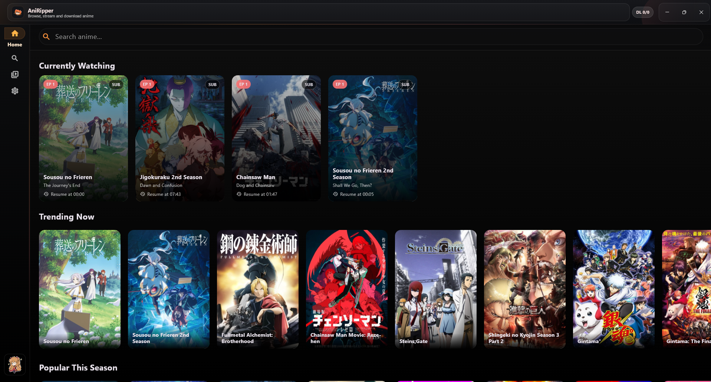
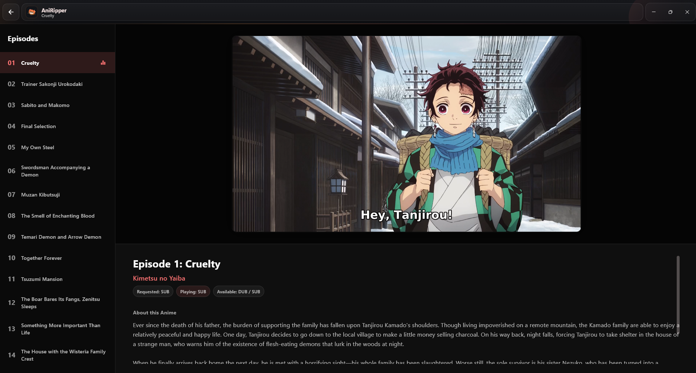

# AniRipper

  

  <b>Desktop anime player and downloader</b> 
  Stream, resume, and queue episode downloads with Sub/Dub support.

  

## What Is AniRipper?

**AniRipper** is a desktop app for:

- **Browsing anime**
- **Streaming episodes**
- **Switching between Sub / Dub / Auto**
- **Resuming where you left off**
- **Downloading episodes with a built-in queue**

It is designed as a **portable Windows app**: extract the release zip, keep the files together, and run `AniRipper.exe`.

## Features

### Playback

- **Embedded video player**
- **Sub / Dub / Auto** stream selection
- **Episode list navigation**
- **Resume playback** from saved timestamp
- **Retry playback** while keeping your position
- **Skip Intro** (automatic timings when available, manual fallback)

### Progress Tracking

- **Currently Watching** section on the home screen
- **Saved watch progress** across app restarts
- **Resume button** on anime detail pages
- **Watched episode indicators**

### Downloads

- **Single episode download**
- **Batch downloads** (start episode + count)
- **Full-anime queueing**
- **Download queue / status tracking**
- **Open output folder** directly from the app

### Quality of Life

- **Search + browse home categories**
- **Settings screen** for language, paths, and behavior
- **Library tab** for download management
- **Custom desktop window controls**

## Screenshots

Replace these images with your actual app screenshots in `docs/images/` using the same filenames.

### Search

  

### Anime Details

  

### Player

  

### Downloads / Library

  

### Settings

  

## Download & Install (Windows)

1. Download the latest release zip from **GitHub Releases**.
2. Extract it to a folder (for example: `C:\Apps\AniRipper`).
3. Make sure the folder contains:
   - `AniRipper.exe`
   - `bridge.exe`
   - `ffmpeg.exe`
   - `data` folder
   - `.dll` files that came with the release
4. Launch **`AniRipper.exe`**.

## Important (Portable App)

- **Keep all files together in the same folder.**
- Do **not** move only `AniRipper.exe` somewhere else.
- `bridge.exe` and `ffmpeg.exe` should stay in the same folder as the app executable.

## First Launch

On first launch, check the **Settings** tab:

- **FFmpeg Executable** should point to the local bundled `ffmpeg.exe`
- **Default Stream Language** should be set to your preference (`Sub`, `Dub`, `Auto`)
- **Download Folder** should be a location you want to use

## How To Use

### 1. Browse or Search

- Use **Home** to browse featured/trending anime
- Use **Search** to find a specific title

### 2. Open an Anime

- Click a title card to open the **Anime Details** page
- View synopsis, season selection (if available), and episode list

### 3. Start Watching

- Click **Play First Episode** or choose a specific episode from the list
- Use the player controls to:
  - pause/play
  - change volume
  - toggle fullscreen
  - switch `Sub / Dub / Auto`
  - skip intro

### 4. Resume Later

- AniRipper automatically saves your progress
- You can resume from:
  - **Currently Watching** on Home
  - **Resume Episode** button on Anime Details

### 5. Download Episodes

From the Anime Details page you can:

- Download a **single episode**
- Download **multiple episodes**
- Queue **the full anime**

Track progress in the **Library** tab.

## Library / Downloads

The **Library** tab shows your download queue and job statuses:

- `Queued`
- `Resolving`
- `Downloading`
- `Completed`
- `Failed`
- `Skipped`

You can also:

- open the download folder
- clear finished jobs
- inspect error messages for failed downloads

## Settings

### Downloads

- **Download Folder**
- **Overwrite Existing Downloads**
- **FFmpeg Executable**

### Playback

- **Default Stream Language**
- **Auto Intro Detection**

### Integration

- **Python Executable** (usually not needed for standalone releases if `bridge.exe` is included)

## Saved Data (Progress & Settings)

AniRipper stores local data here:

- `%APPDATA%\fstr_anime_ripper`

This includes things like:

- watch progress
- settings

## Troubleshooting

### App starts, but downloads fail

Check:

- `ffmpeg.exe` is in the same folder as `AniRipper.exe`
- **Settings > FFmpeg Executable** points to the correct file
- your download folder is writable

### App starts, but playback fails

Try:

- another episode/title (provider availability can vary)
- switching **Sub / Dub**
- retrying playback

### App cannot find bridge runtime

Make sure:

- `bridge.exe` is next to `AniRipper.exe`

### I moved the EXE and now things break

Put the EXE back into the original release folder with all bundled files, or re-extract the release zip.

## FAQ

### Does AniRipper save my watch progress?

Yes. Progress is stored locally and is used for resume features.

### Do I need to install FFmpeg separately?

Not for the portable release, **if `ffmpeg.exe` is included in the release folder**.

### Do I need Python installed?

Not for the standalone release, **if `bridge.exe` is included**.

### Why does Skip Intro sometimes not show exact timings?

Intro timing data is not available for every episode/title, so AniRipper falls back to a manual skip.

## Notes

- Stream availability depends on external providers and may vary.
- Some titles may have only Sub or only Dub available depending on source/provider.
- Use the app responsibly and in compliance with your local laws and content source terms.
